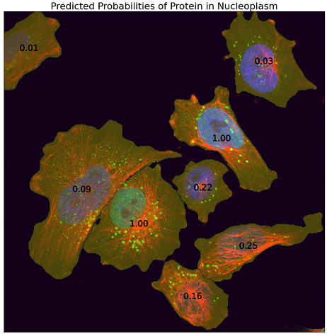
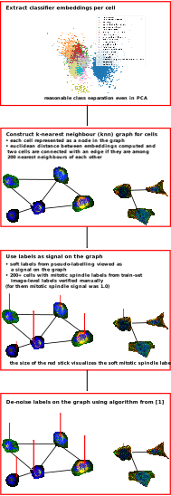
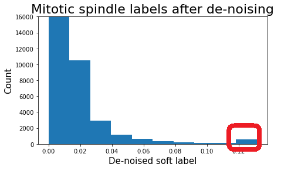
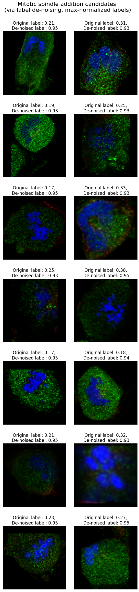

# Human Protein Atlas - Single Cell Classification Challenge

## Intro
The challenge was hosted on [Kaggle](https://www.kaggle.com/c/hpa-single-cell-image-classification).

The competition was about a fascinating but challenging task to learn single-cell patterns out of noisy image-level labels while enhancing cell segmentation in terms of accuracy and computational efficiency. 
For illustration purposes, here is an output of my model for a test image:



## Position
I finished 23rd out of 757 teams. 

My private leaderboard score is 0.50016

*Submissions were evaluated by computing mAP (mean average precision), with the mean taken over the 19 segmentable classes of the challenge.*

## Basic info about the team
My team was named Raman, I competed solo ([CV](https://drive.google.com/file/d/12UHJ1aJZ4Brgrs6230yZFoF-M_uhkLTx/view?usp=sharing)). 

## Solution

### Main points
 - modest DenseNet121 model (modest by modern standards), pre-trained on the [previous Human Protein Atlas competition](https://www.kaggle.com/c/human-protein-atlas-image-classification) by [bestfitting](https://www.kaggle.com/bestfitting), manageable with a modest GPU (GTX 1080 Ti);
 - focus on de-noising to address the weak labels challenge
   - **Problem: Image-level label uncertainty**. *" The image-level labels are what we refer to as weak or noisy. During annotation, the image-level labels are set per sample (i.e per a group of up to 6 images from the same sample). This means that the labels present in the majority of the images will be annotated." ([by Prof. Emma Lundberg](https://www.kaggle.com/c/hpa-single-cell-image-classification/discussion/220748#1213064))*
   - **Solutions**: 
     - *gradient accumulation over 200 batches when training on image-level labels*. 
     **Rationale**: motivated by Google's paper ["Don't decay the learning rate, increase the batch size" by Smith, Samuel L., et al.](https://arxiv.org/pdf/1711.00489.pdf). The paper demonstrates that large batch sizes tend to average out label noise and lead to better model performance. According to the paper, to achieve that, large batch size should be used in later stages of training, because in the beginning of training, noisy updates of weights help to avoid local minima of the loss function.
      I started with the weights pre-trained specifically on the HPA dataset. Therefore, I did not have to first train the net with a smaller batch size, 
      I used large batch size straight away. To achieve large batch size on a GPU with modest memory, I accumulated gradients over 200 batches, 
      which led to effective batch size of 1600.
     - *pseudo-labeling individual cells using the image-level model trained with gradient accumulation*.
     **Rationale**: motivated by the paper ["Learning from Weak and Noisy Labels for Semantic Segmentation" by Lu, Zhiwu, et al.](https://qmro.qmul.ac.uk/xmlui/bitstream/handle/123456789/12661/imparsing_final.pdf?sequence=1&amp;isAllowed=y). 
     The authors of the paper used pseudo-labeling to further reduce label noise, arguing that pseudo-labels produced by machine learning model "enforce the appearance consistency for
each object category globally across the whole training set,
thus having the potential to further reduce the
label noise."
     - *mathematical optimization for label noise reduction, based on graph signal de-noising*. 
     **Rationale**: I implemented and leveraged the algorithm from the relevant paper ["Learning from Weak and Noisy Labels for Semantic Segmentation" by Lu, Zhiwu, et al.](https://qmro.qmul.ac.uk/xmlui/bitstream/handle/123456789/12661/imparsing_final.pdf?sequence=1&amp;isAllowed=y). 
     The main idea how to leverage graph signal de-noising is depicted in the figure below:
     
     
     The algorithm from the paper enforces label sparsity so that each object would have a 
     single confident label after the de-noising. Therefore, outputs of the de-noising were not used directly. 
     I focused on the group of cells having the highest mode in the de-noised soft labels for mitotic spindle, as mitotic spindle turned out to be the most challenging class (due to rare occurrence and the per-sample labeling of images described above). As a result, I've added mitotic spindle label to around 500 cells from the highest de-noised values:
     
     
     
     Below are some added mitotic spindle labels, where initial pseudo-labels were below 0.4.
     For image titles I scaled the de-noised labels to [0, 1] range. 
     
     
     
     *After the end of the competition I checked if the outputs of the de-noising can be used to remove mitotic spindle labels. However, the per-sample labeling described above obviously resulted in the missed cells (false negatives), but false positives were not the major label noise.*
 - I designed my solution for the high single-cell variation (SCV) scenario. 
   - I avoided heuristical re-ranking based on image-level labels in order to limit influence of image-level labels on individual cells. *Even though initially I leveraged image-level predictions to heuristically
 rank individual cell predictions, e.g. in [my public notebook I shared with the community in the beginning of the competition](https://www.kaggle.com/samusram/hpa-rgb-model-rgby-cell-level-classification). But then I decided to be rigorously focused on the high SCV.*
   - When predicting a single cell, I masked all surrounding cells out, so that in the high SCV scenario, predictions would not be wrongly influenced by neighboring cells in the bounding box.
   
   *In the end, based on the community comments, it seems that both these high-SCV-focused design choices led to worse leaderboard score, suggesting that in the test set there were not so many high SCV cases and predictions from neighbouring cells actually supported correct single-cell labels.*
 - I improved computational efficiency of the segmentation library provided by the competition hosts (the optimized version was [shared early in the competition](https://www.kaggle.com/samusram/even-faster-hpa-cell-segmentation) and reportedly was leveraged by multiple top-performing teams).
 I also included minor improvements like filtering of small nuclei based on median size of nuclei in the given image instead of the hardcoded threshold, I also removed smaller border cells.
 - I estimated negative label probability as 
 
 .

Estimating P_{neg} this way instead of trying to predict the negative label boosted my public LB score from 0.517 to 0.523. This gave almost the same result as estimation of negative label probability under the assumption of labels independence: 


 
 - I used only basic flip augmentations during training and flip/rotation/scale-shift as test-time augmentations.
 - My main loss function was focal loss, both for initial image-level labels as well as soft pseudo labels. Analogously to the winning solution to the [previous Human Protein Atlas competition](https://www.kaggle.com/c/human-protein-atlas-image-classification) by [bestfitting](https://www.kaggle.com/bestfitting), I used hard negatives mining loss and Lovasz hinge loss (treating the 19 labels as 19 pixels for the Lovasz loss).
 - I split data into 5 folds using multi-label stratified k-fold split from [this library](https://github.com/trent-b/iterative-stratification).
 - I defined manual learning rate schedules, the schedules were not optimized based on the leaderboard/validation performance.
 - When training on image-level labels I used validation focal loss to select the best checkpoints, when training on cell-level de-noised soft labels I used validation accuracy, where accuracy was computed per 0.05-wide bins. E.g., if a soft label was 0.23, then predictions in the interval [0.20, 0.25] where considered a hit.
 - I used public HPA data downloaded using [code shared by the competition hosts](https://www.kaggle.com/lnhtrang/hpa-public-data-download-and-hpacellseg).
 - I used 8 bit images, the image-level model worked with 1024x1024 images, and the cell-level model worked with 512x512 images.

### How to reproduce the result

#### Downloading resources
 1. Please, download the competition data from [the Kaggle page](https://www.kaggle.com/c/hpa-single-cell-image-classification/data) and place the data into a folder `../input/hpa-single-cell-image-classification`
 2. Please, download the public HPA data using [code shared by the competition hosts](https://www.kaggle.com/lnhtrang/hpa-public-data-download-and-hpacellseg) and place the data into a folder `../input/publichpa_1024`
    
    *Due to limited disk space, I downscaled the public data to 1024x1024*
 3. Please, download the previous-HPA-competition model by [bestfitting](https://www.kaggle.com/bestfitting) from [here](https://kth.app.box.com/s/gw43cvngx6quknq8ana9um1xx3ajhi4a) and extract the models into a folder `../input/pretrained_models/models`.

#### Data preparation
 1. Detection of negative patterns with strong staining.
   
    *Please, note that the final submission does not use predictions of Negative patterns, I include the detection of Negatives with strong signal in the green channel for the reproducibility purposes only.*
 
    `python -m src.preprocessing.detect_negatives_with_obvious_staining`
    
    `python -m src.preprocessing.detect_negatives_with_obvious_staining --public-data`
 2. Create folds using multi-label stratified k-fold split:
    
    `python -m src.preprocessing.create_imagelevel_folds --obvious-staining`

 3. Detect duplicated images like [bestfitting](https://www.kaggle.com/bestfitting) did in the previous competition.
 
    `python -m src.preprocessing.bestfitting_duplicates_search`
    
 4. Install the enhanced cell segmentation from [here](https://github.com/SamusRam/HPA-Cell-Segmentation) and generate cell bounding boxes. 
    For each bounding box, this will also store pixel indices of "alien" masks, i.e. of masks of other cells which are also visible in the current cell bounding box. 
    This will enable efficient masking during training.
    
    ```
    python -m src.preprocessing.generate_cell_bboxes
    
    # for some reason it crashed without any error message (exhausted RAM and got killed by OS?), just cleaning the unfinished files with find . -type f -size 0 -delete and then restarting helped
    python -m src.preprocessing.generate_cell_bboxes --public-data
    ```
    
 5. Create folds for label noise reduction based on the paper ["Learning from Weak and Noisy Labels for Semantic Segmentation" by Lu, Zhiwu, et al.](https://qmro.qmul.ac.uk/xmlui/bitstream/handle/123456789/12661/imparsing_final.pdf?sequence=1&amp;isAllowed=y)
    
    *I split all the cells into 3 folds just to speed-up the de-noising. Cells from each image are splitted into different folds, equally between the folds when possible.*
    
    `python -m src.preprocessing.create_denoising_folds`

#### Image-level training

*Please, note that I will post command for one fold, iteration over all the folds can be performed manually for all 5 folds, or using simple bash scripts analogous to the ones in `orchestration_scripts`*

```
fold_i=0
python -m src.train.train_bestfitting --fold $fold_i --gpu-id 0 --img_size 1024 --batch_size 8 --workers 22 --gradient-accumulation-steps 200 --scheduler Adam10 --epochs 10 --scheduler-lr-multiplier 4 --out_dir densenet121_1024_all_data__obvious_neg__gradaccum_200__start_lr_4e5 --eval-at-start 

# final super-low-learning-rate tuning
python -m src.train.train_bestfitting --fold $fold_i --gpu-id 0 --img_size 1024 --batch_size 8 --workers 22 --gradient-accumulation-steps 20 --scheduler Adam10 --epochs 10 --scheduler-lr-multiplier 0.3 --out_dir densenet121_1024_all_data__obvious_neg__gradaccum_20__start_lr_3e6  --load-state-dict-path "../output/models/densenet121_1024_all_data__obvious_neg__gradaccum_200__start_lr_4e5/fold${fold_i}/final.pth" --eval-at-start"
```

#### Pseudo-labeling

```
python -m src.predict.predict_cells_from_image_level_densenet 
```
*Please, note that I have manually parallelized the pseudo-labeling per available GPU's, e.g.,* 
`python -m src.predict.predict_cells_from_image_level_densenet --fold-single 1 --fold-one-fifth-number 0`

*Please, also note, that due to concerns that I might run out of RAM, I created a separate h5 file for each image, this approach has significant disk usage overhead and can be optimized.*

The outputs per individual images are then merged via
```
python -m src.preprocessing.unify_predictions_from_image_level_densenet
python -m src.preprocessing.unify_embeddings_from_image_level_densenet
```

#### Labels noise reduction
```
# there are 3 folds only (different folds, please, see explanation above)
python -m src.denoising.graph_denoising --fold 0
```
The results are to be manually investigated. It should be straightforward to load outputs of the script `src.denoising.graph_denoising` and select candidate cells of interest, e.g.,
```

# Y_init contains labels before application of de-noising
# Y_opt contains labels after de-noising

class_i = class_names.index('Mitotic spindle')
negative_init_label_threshold = 0.4
positive_denoised_threshold = Y_opt[:, class_i].max()*0.92

addition_bool_idx = ((Y_init[:, class_i]  < negative_init_label_threshold) & 
              (Y_opt[:, class_i] >= positive_denoised_threshold))
```
Then please put the picked positive cells in the file `../input/mitotic_cells_selection.csv`. The csv file must contain columns `ID,cell_i` where cell_i corresponds to the stored masked cell bounding boxes.

#### Cell-level training


```
fold_i=0
python -m src.train.train_cellwise --fold $fold_i --gpu-id 0 --img_size 512 --batch_size 32 --workers 10 --gradient-accumulation-steps 4 --cell-level-labels-path ../output/densenet121_pred.h5 --scheduler Adam10 --epochs 5 --scheduler-lr-multiplier 4 --out_dir densenet121_512_cellwise__gradaccum_4__start_lr_4e5  --load-state-dict-path "../output/models/densenet121_1024_all_data__obvious_neg__gradaccum_20__start_lr_3e6/fold${fold_i}/final.pth" --loss FocalSymmetricLovaszHardLogLoss
```

#### Overall time (with HPA public data included)
  - *Image-level training*: ~12.5 hours per fold on GTX 1080 Ti, i.e., ~12.5 hours on 5x GTX 1080 Ti in total
  - *Pseudo-labeling*: ~20 hours on 3x GTX 1080 Ti
  - *Label noise reduction*: ~14 hours on 2x i7-8700K
  - *Cell-level training*: ~25 hours per fold on GTX 1080 Ti
